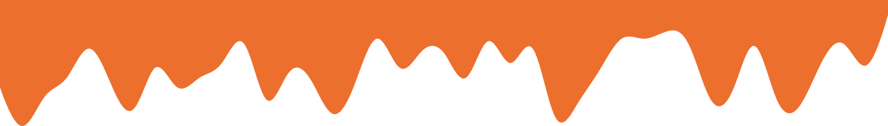

### Hi there, I'm Hamza - 👋

## I'm a software engineer and Simple Young Man!!

- :books: I am a __Software Engineer__
- :seedling: I’m currently interested in scaling up __my career__
- :dancers: I’m always looking to __collaborate with others__ 
- :dart: 2023 Goals: Try new __challenge__ and improve my __German language__
- :zap: Fun fact: I love __Rock&Roll__ music and I'm a big __Anime__ Fan

 

### Connect with me:

[][linkedin]
[][instagram]

 

### Some Languages and Tools:

   

<!-- Identifiers -->
[linkedin]: https://linkedin.com/in/essaadyhamza
[instagram]: https://instagram.com/kuo_ham_kun

